# 💊 MediSync — Smart Medicine Reminder (IoT)

> An ESP32-based smart medicine reminder system that syncs with Firebase Firestore, provides real-time audio/visual alerts, and tracks medication intake status.

---

## 📋 Table of Contents

- [Overview](#overview)
- [Features](#features)
- [App UI Screenshots](#app-ui-screenshots)
- [Hardware](#hardware)
- [Software & Libraries](#software--libraries)
- [System Architecture](#system-architecture)
- [Firebase Setup](#firebase-setup)
- [Configuration](#configuration)
- [File Structure](#file-structure)
- [How It Works](#how-it-works)
- [Cloud Function](#cloud-function)
- [Team](#team)

---

## Overview

MediSync is an IoT medicine tracking device built around the **ESP32 microcontroller**. It fetches scheduled medicine intake times from **Firebase Firestore**, triggers alerts (buzzer + LED + audio) when a dose is due, and allows the user to confirm or miss an intake via a physical button. All status updates are synced back to the cloud in real time.

---

## Features

- ⏰ **RTC-driven scheduling** -> DS1307 real-time clock keeps accurate time; auto-synced on boot
- ☁️ **Firebase Firestore sync** -> fetches medicine data every 60 seconds; updates intake status (pending → taken / missed)
- 🔔 **Multi-modal alerts** -> buzzer beeping pattern + LED blinking + DFPlayer Mini audio playback
- 📺 **20×4 LCD display** -> shows current time, scrolling medicine list, alert screen, and confirmation screen
- ✅ **Button-driven confirmation** -> first press dismisses the alert; second press confirms intake
- ⏱️ **Auto-miss after 5 minutes** -> if no response, status is automatically set to `missed`
- 🔄 **Daily status reset** -> Firebase Cloud Function resets all statuses to `pending` on a schedule

---

## App UI Screenshots

### Authentication & Profile
| Login | Signup | Forgot Password |
|:---:|:---:|:---:|
| 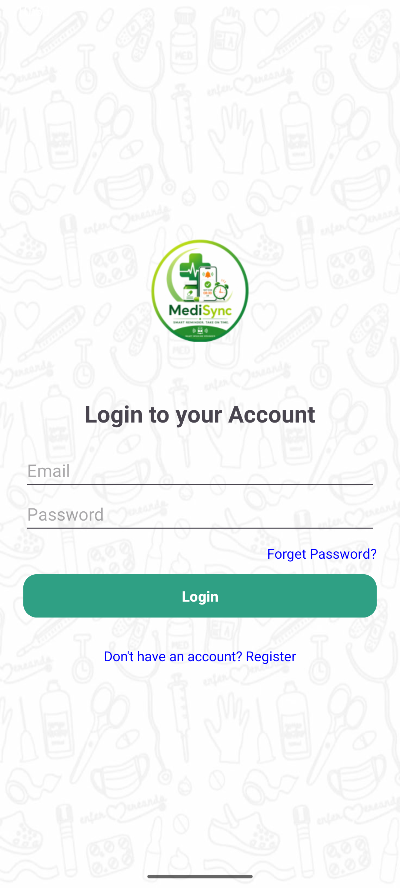 | 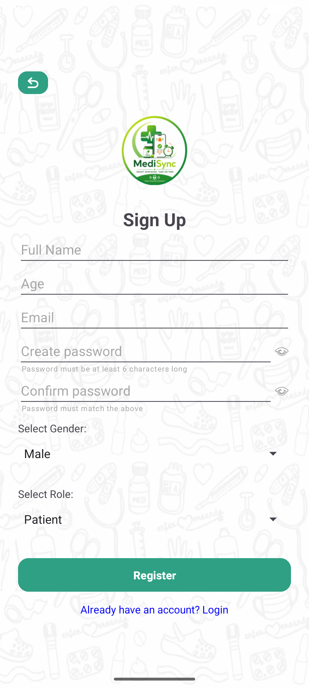 | 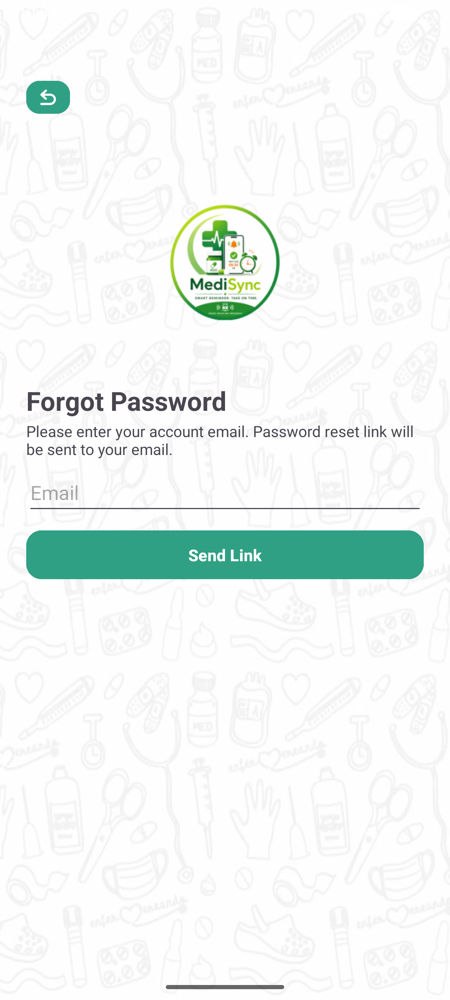 |

| Doctor Profile | Patient Profile | Edit Profile | Change Password |
|:---:|:---:|:---:|:---:|
| 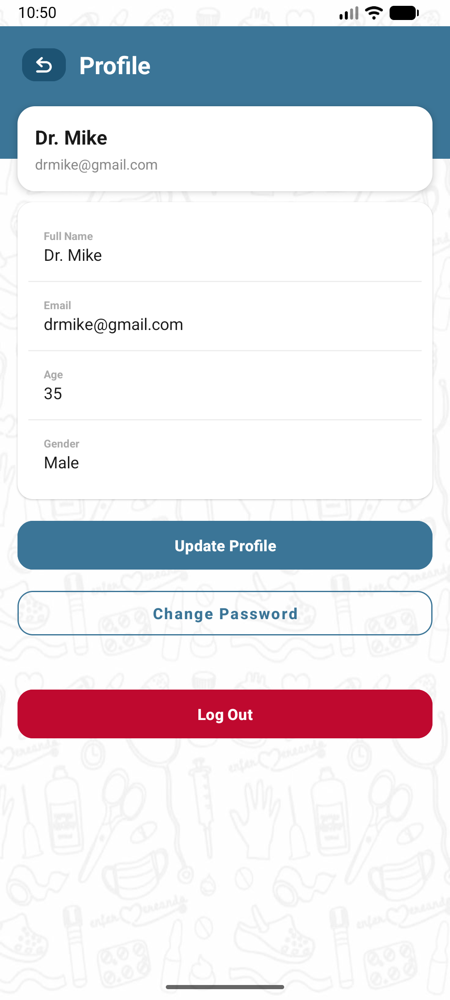 | 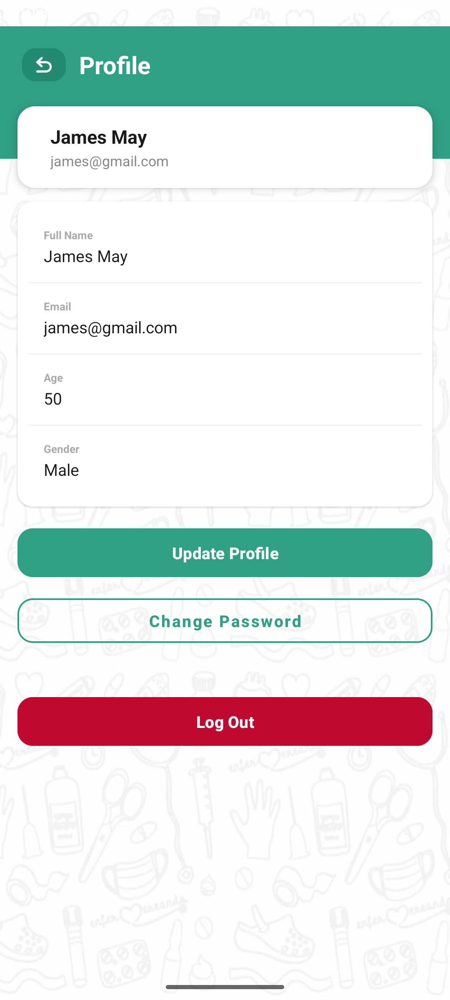 | 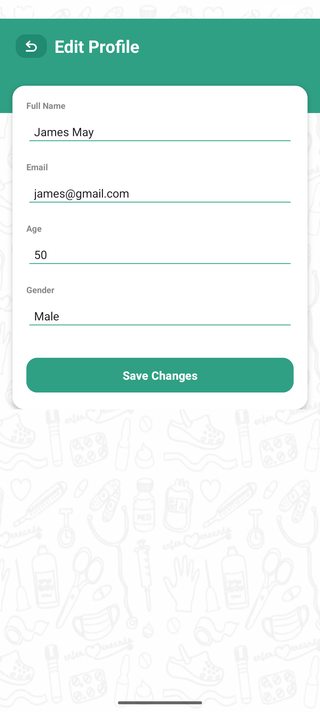 | 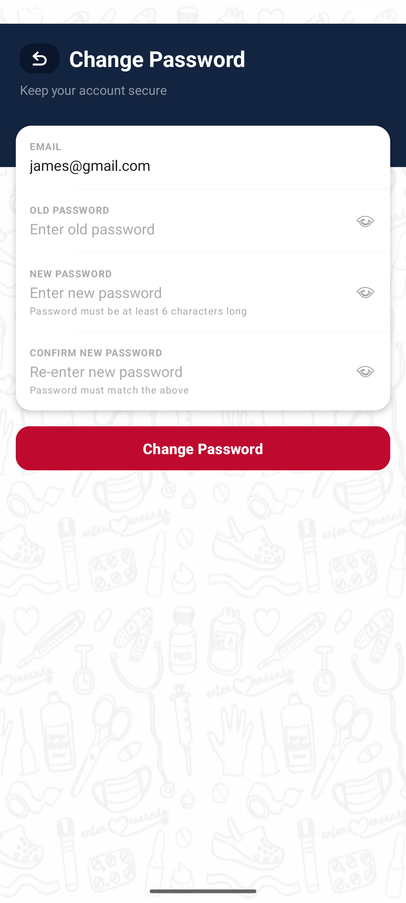 |

### Dashboards & Management
| Doctor Dashboard | Patient Dashboard | Patient Management |
|:---:|:---:|:---:|
| 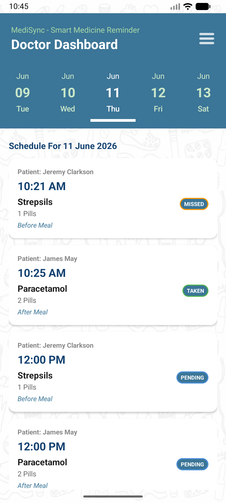 | 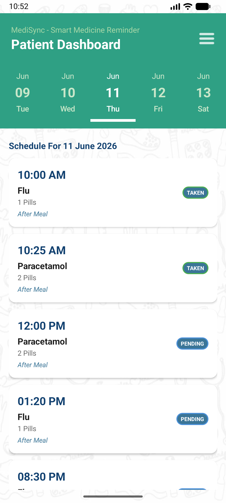 | 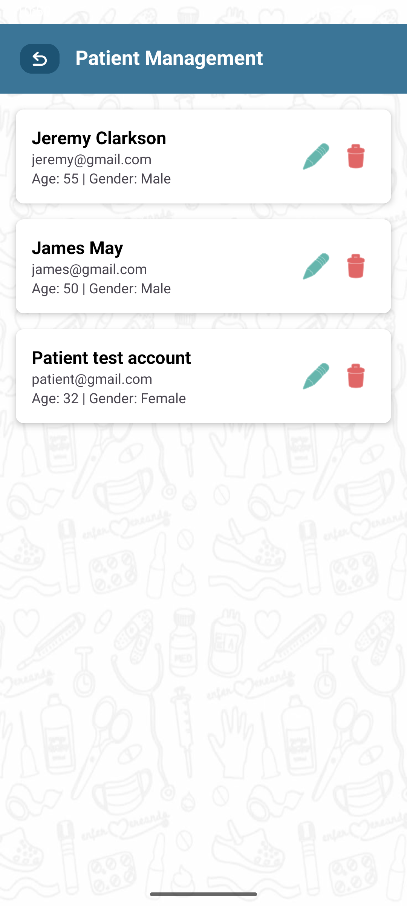 |

### Medication Scheduling
| Create Schedule | Manage Schedule | Update Status |
|:---:|:---:|:---:|
| 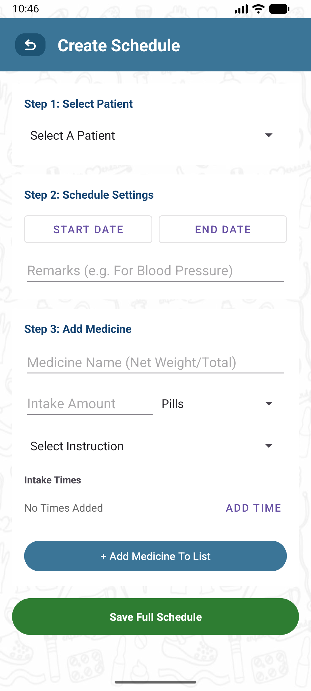 | 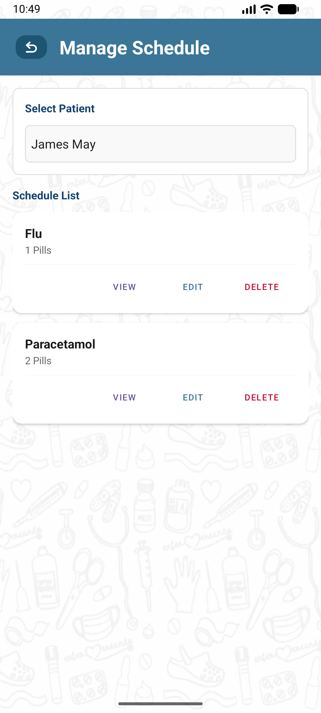 | 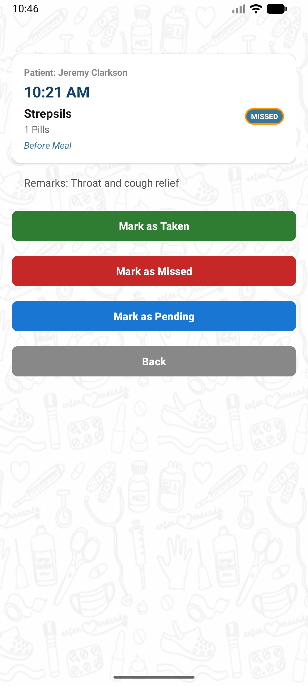 |

---

## Hardware

| Component | Description | ESP32 Pins |
|---|---|---|
| ESP32 DevKit | Main microcontroller | — |
| DS1307 RTC | Real-time clock module | SDA: GPIO 18, SCL: GPIO 19 |
| 20×4 I2C LCD | Display (addr `0x27`) | SDA: GPIO 13, SCL: GPIO 12 |
| DFPlayer Mini | MP3 audio module | RX: GPIO 25, TX: GPIO 26 |
| Buzzer | Audible alert | GPIO 5 |
| LED | Visual alert indicator | GPIO 27 |
| Push Button | Dismiss / confirm intake | GPIO 14 (INPUT_PULLUP) |

---

## Software & Libraries

- **Framework:** Arduino / ESP32 (PlatformIO or Arduino IDE)
- **Backend:** Firebase Firestore + Firebase Cloud Functions (Node.js)

### Arduino Libraries

| Library | Purpose |
|---|---|
| `ArduinoJson` | Parse/build Firestore JSON payloads |
| `WiFiClientSecure` | HTTPS connections to Firestore REST API |
| `HTTPClient` | HTTP GET / PATCH requests |
| `RTClib` | DS1307 RTC interface |
| `LiquidCrystal_I2C` | LCD display |
| `DFRobotDFPlayerMini` | DFPlayer Mini audio module |

---

## System Architecture

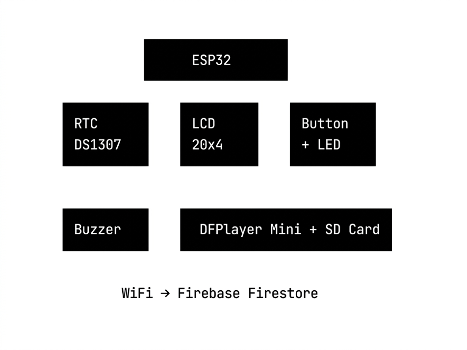

---

## Firebase Setup

1. Create a Firebase project at [console.firebase.google.com](https://console.firebase.google.com)
2. Enable **Firestore Database** in Native mode
3. Create the following document structure:

```
users/
  └── {USER_ID}/
        └── medicines/
              └── {docId}/
                    ├── name         (string)
                    ├── amount       (string)
                    ├── unit         (string)
                    ├── instruction  (string)
                    ├── remarks      (string)
                    ├── endDate      (timestamp)
                    └── intakeTimes  (map)
                          ├── "0":  { time: "08:00 AM", status: "pending" }
                          ├── "1":  { time: "01:00 PM", status: "pending" }
                          └── ...
```

4. Enable **Anonymous Auth** or obtain an API key for REST access
5. Deploy the Cloud Function (see [Cloud Function](#cloud-function) section)

---

## Configuration

Copy `config.h` and fill in your credentials:

```cpp
// config.h
#define WIFI_SSID        "your_wifi_ssid"
#define WIFI_PASSWORD    "your_wifi_password"

#define FIREBASE_API_KEY "your_firebase_api_key"
#define PROJECT_ID       "your_project_id"
#define USER_ID          "your_firestore_user_document_id"
```

> ⚠️ **Do not commit real credentials to a public repository.** Consider using a `config.local.h` excluded via `.gitignore` for production use.

### Timing Constants

| Constant | Default | Description |
|---|---|---|
| `FETCH_INTERVAL_MS` | 60,000 ms | How often to re-fetch Firestore data |
| `CHECK_INTERVAL_MS` | 30,000 ms | How often to check for due medicines |
| `ALERT_AUTO_STOP_MS` | 300,000 ms | Auto-dismiss alert after 5 minutes |

---

## File Structure

```
MediSyncGroup11/
├── src/
│   ├── main.cpp          # Main loop: scheduling, alert triggering, LCD updates
│   ├── firebase.cpp      # Firestore GET (fetch) and PATCH (update status)
│   ├── firebase.h        # Medicine struct, function declarations
│   ├── alert.cpp         # Buzzer, LED, DFPlayer control
│   ├── alert.h
│   ├── display.cpp       # All LCD display functions
│   ├── display.h
│   └── config.h          # WiFi, Firebase, pin, and timing config
├── functions/
│   └── index.js          # Firebase Cloud Function (scheduled status reset)
├── sd_card/
│   ├── 0001.mp3          # Alert sound (loops while alert is active)
│   └── 0002.mp3          # Confirmation sound (plays once on intake confirm)
└── README.md
```

> **SD Card naming:** DFPlayer Mini requires files named `0001.mp3`, `0002.mp3`, etc. in the root of the SD card.

---

## How It Works

### Boot Sequence
1. Initialise I2C buses, LCD, RTC, buzzer, DFPlayer
2. Connect to WiFi
3. Sync RTC time from NTP (UTC+8, Malaysia)
4. Fetch medicine data from Firestore
5. Enter main loop

### Main Loop
- **Every 500 ms** — update LCD clock; check for active alerts and button presses
- **Every 30 s** — compare current RTC time against all `pending` intake times; trigger alert on match
- **Every 60 s** — re-fetch Firestore to pick up any schedule changes

### Alert Flow
```
Due time matches current time
        ↓
  alertTrigger()
  Buzzer beeps + LED blinks + Audio loops
        ↓
  User presses button (dismiss)
        ↓
  Show medicine details on LCD
        ↓
  User presses button again (confirm intake)
        ↓
  Firestore PATCH → status: "taken"

  (If no response after 5 min)
        ↓
  Firestore PATCH → status: "missed"
```

---

## Cloud Function

Located in `functions/index.js`. Resets all medicine intake statuses back to `"pending"` daily (e.g. at midnight).

### Deploy

```bash
cd functions
npm install
firebase deploy --only functions
```

### Manual Trigger (HTTP)

The function also exposes an HTTP endpoint for manual testing:

```
GET https://<region>-<project-id>.cloudfunctions.net/resetMedicineStatuses
```

---

## Team

**Group 11** - Diploma in Computer Science, UTM SPACE

| Name  | Role                       |
|-------|----------------------------|
| Shaan | Scrum Master & Application |
| Arif  | Hardware & Application     |
| Irfan | Application & Report       |
| Yoha  | Tester & Report            |


---

*MediSync - because missing a medicine shouldn't be an option.*
